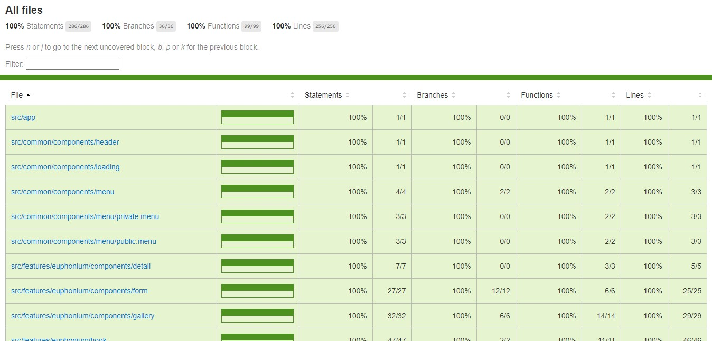
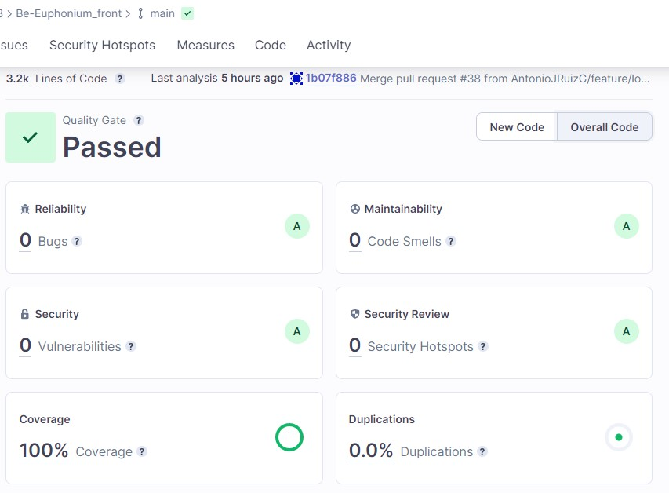

# 🎶 Community of Euphonium Enthusiasts

## Description

Web application that offers euphonium enthusiasts a social network for sharing their musical interests.

✅ Link to the project: <https://beeuphonium.netlify.app/>

## Info

Final project of a great fullstack web development bootcamp in which I participated 🚀

The goal is not just to develop the application, but also to collaborate with classmates and implement best practices.

The following screenshots of the Jest coverage file and the SonarCloud project summary show the challenge of ensuring code quality by eliminating bugs and code smells, achieving 100% test coverage and 0% code duplication through unit testing and CI/CD tools.

## Full-Stack app

This is the Frontend repository of a fullstack app.

Find the repository with the Backend here:
<https://github.com/AntonioJRuizG/Be-Euphonium_back/network>

## Features

- Gallery of items.
- Item detail page.
- Add/Edit page.
- Delete item.
- Pagination.
- Gallery filter by item characteristics.
- User registration and login.
- Feedback to the user.

## Project characteristics

### Frontend

- TypeScript.
- React: lazy loading, conditional rendering, router, controlled form.
- State management with Redux.
- moduleCSS / styled components.
- Responsive design.
- Unit testing.
- 100% test coverage.
- SonarCloud code analisys.
- Zero technical debt.
- Lighhouse performance, Accessibility, Best Practices and SEO audit.
- Error handling.
- 404 page.
- Deployment: Netlify.

### Backend

- TypeScript.
- Node.JS + Express.
- auth0.
- Unit testing.
- 100% coverage
- SonarCloud code analisys.
- 0% technical debt.
- End-to-end test.
- Firebase images storage.
- Postman endpoint collection.
- Deploy: onrender.com.

### Project managment

- Trello.
- Component responsibilities.
- Figma.

## Thanks

Thanks to the main teacher, teaching assistants and classmates for their help and encouragement during the project. Without you I would not have got nearly as far as I did 🎉
